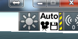
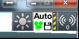
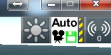
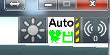
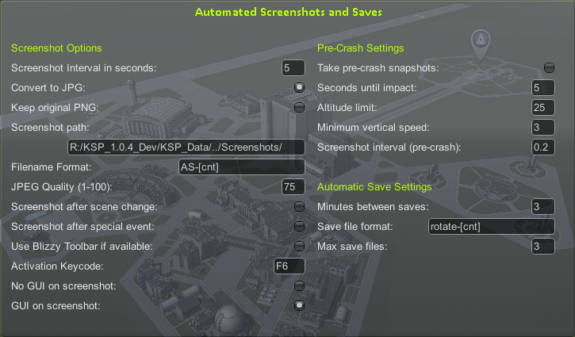

# Automated Screenshots /L Unleashed

A mod to grab automated screenshots at specific time intervals and special events.

[Unleashed](https://ksp.lisias.net/add-ons-unleashed/) fork by Lisias.

## In a Hurry

* [Latest Release](https://github.com/net-lisias-kspu/AutomatedScreenshots/releases)
    + [Binaries](https://github.com/net-lisias-kspu/AutomatedScreenshots/tree/Archive)
* [Source](https://github.com/net-lisias-kspu/AutomatedScreenshots)
* [Change Log](./CHANGE_LOG.md)

## Description

A mod to grab automated screenshots at specific time intervals and special events

Additionally, can do automated saves.

This mod will take screenshots at specified intervals.

The following are the ways that screenshots can be taken:

1.  The intervals can be specified by time in seconds between each screenshot. The smallest interval allowed is approximately 0.03 sec, if you really want to kill your performance and disk
2.  Screenshots can be taken at each scene change
3.  Screenshots can be taken at special events.
4.  The UI can be hidden during the screenshots.  Be aware that this will be visible, the UI will flicker off and then on during the screenshot.
5.  If options to both show and hide the UI are specified, then two screenshots will be taken, one with and one without the UI
6.  Pre crash/landing detection is added, so if specified, then faster screenshots will be taken just before crashes
7.  Integration with Historian.  If Historian is loaded and configured, AS will call Historian before each screenshot to activate the ribbon
8.  Automatic Saves.  The mod will now do automatic saves at specified intervals.  It will only keep a specified number of save files.

The screenshots are saved as PNG files.  PNG files can be big, so you can also specify that the PNG files be converted to JPG files, and optionally delete the PNG file after conversion.

The filename is fully configurable, by using variables in the file name.

The following are the "variables" available in file names:

* [date] = Parsed DateString
* [UT] = Current in-game time in seconds
* [save] = Name of current save game
* [vessel] = Active Vessel name
* [body] = Current primary celestial body name
* [situation] = Active Vessel situation (PRELAUNCH, FLYING, ORBITING, etc.)
* [biome] = Current Active Vessel biome
* [year] = Current in-game year (as seen in top left during flight (1, 2, etc.))
* [day] = Current in-game day (similar to year)
* [hour] = in-game hour
* [min] = in-game minute
* [sec] = in-game seconds
* [evt] = event flag

### Event Flag

1. If a screenshot by time interval: time
2. If by scene change: scene
3. If by special event: event

An (ridiculous) example of filename is: 
`AS_[date]_[save]_[vessel]_[body]_[biome]_[situation]_Y[year]_D[day]_H[hour]_M[min]_S[sec]_UT[UT]`

which could turn out to be: 
`AS_2015-04-30-22-22_KSPv1.0.0_SaveGameTest_Kerbal#X_Kerbin_Shores_PRELAUNCH_Y1_D10_H5_M7_S36_UT212856.png`

The code for the JPG conversion and the custom filenames was taken from the Sensible Screenshot mod, written by magico13

### Automated Saves

The mod will now do automatic saves at specified intervals. it will only keep a specified number of save files.

Automatic saves is turned on by hitting Ctrl-F5.

### Usage

Assuming you are using the default of F6 for the screenshots, the icon in the toolbar will be one of the following. The icons for the regular toolbar and the Blizzy toolbar are the same except for size:

|                          |                                   |                       |
|:-------------------------|:---------------------------------:|:----------------------|
| 1. All White             |            | Nothing is activated
| 2. Reversed              |                                   | Configuration window is active
| 3. Green camera          |   | Automated screenshots are active
| 4. Green disk            |   | Automated saves are active
| 5. Green camera and disk |  | Both automated screenshots and automated saves are active

### Configuration

New Feature added (not in screen below yet): Supersize Screenshots

***Important note regarding the Supersize option***: The values range from 0-4. 0 is the default, 1 is the same as 0.

Note that a value of 4 can take up to a second to do the screenshot. This option is extremely processor intensive, only use it if you need it for cinematics.

Set this to the factor which you want your screen resolution to be multiplied by. For example, if your game resolution is 1280x720, setting the number here to 2 would give you screenshots of size 2560x1440.

See the image below for the configuration screen. Explanations of the fields are below the image:

* Screenshot interval in seconds
	+ Time between each screenshot. You can go down to 1/10 of a second
* Convert to JPG
	+ Screenshots are saved as PNG files, which are large. This will convert the saved file to a JPG file, which is a lot smaller
* Keep original PNG
	+ If checked, will keep the original PNG file after conversion
* Screenshot path
	+ Path to save screenshots. Defaults to standard screenshot folder
* Filename format
	+ The filename is completely configurable. See the section on the filename variables for complete information
* JPEG Quality
	+ Quality of the converted JPG. Default is 75, I suggest you leave it there. Lower numbers means a smaller file, but also a loss of quality
* Screenshot after scene change
	+ If you want an additional screenshot after each scene change, enable this
* Screenshot after special event
	+ KSP has special events (ie: crash, crew killed, etc). See the section on special events for more details
* Use Blizzy Toolbar if available
	+ If the Blizzy toolbar is installed, use it.
* Activation Keycode
	+ What key will activate the screenshots
* No GUI on Screenshot
	+ Disable the GUI (ie: F2) before taking the screenshot
* GUI on screenshot
	+ Take the screenshot with the GUI on. Both this and the previous can be done, which would result in 2 screenshots
* Take pre-crash snapshots
	+ Take extra snapshots if a crash is imminent
* Seconds until impact
	+ Start taking snapshots this many seconds before impact
* Altitude limit
	+ Must be below this altitude for pre-crash screenshots to be taken.
* Minimum vertical speed
	+ If speed is below this, it isn't a crash
* Screenshot interval (pre-crash)
	+  Interval between screenshots for the pre-crash settings. You can go down to 1/10 of a second
* Minutes between saves
	+ Save the game once this many minutes
* Save file format
	+ Name of the save file, uses same rules as the snapshot files
* Max save files
	+ Keep this many save files and no more, deletes any extra (only of the ones that were saved using this mod

## Installation

To install, place the GameData folder inside your Kerbal Space Program folder.

**REMOVE ANY OLD VERSIONS OF THE PRODUCT BEFORE INSTALLING**.

### Dependencies
* Hard Dependencies
	+ [KSP API Extensions/L](https://github.com/net-lisias-ksp/KSPAPIExtensions) 2.4 or newer

### Licensing

This work is licensed under [GPL 3.0](https://www.gnu.org/licenses/gpl-3.0.txt). See [here](./LICENSE)

+ You are free to:
	- Use : unpack and use the material in any computer or device
	- Redistribute : redistribute the original package in any medium
	- Adapt : Reuse, modify or incorporate source code into your works (and redistribute it!) 
+ Under the following terms:
	- You retain any copyright notices
	- You recognise and respect any trademarks
	- You don't impersonate the authors, neither redistribute a derivative that could be misrepresented as theirs.
	- You credit the author and republish the copyright notices on your works where the code is used.
	- You relicense (and fully comply) your works using GPL 3.0
		- Please note that upgrading the license to any future license version **IS NOT ALLOWED** for this work, as the author **DID NOT** added the "or (at your option) any later version" on the license
	- You don't mix your work with GPL incompatible works.

## UPSTREAM

* [linuxgurugamer](https://forum.kerbalspaceprogram.com/index.php?/profile/129964-linuxgurugamer/)
	+ [Forum](https://forum.kerbalspaceprogram.com/index.php?/topic/116979-141-automated-screenshots/)
	+ [GitHub](https://github.com/linuxgurugamer/AutomatedScreenshots)
	+ [SpaceDock](https://spacedock.info/mod/43/Automated%20Screenshots%20&%20Saves) 
